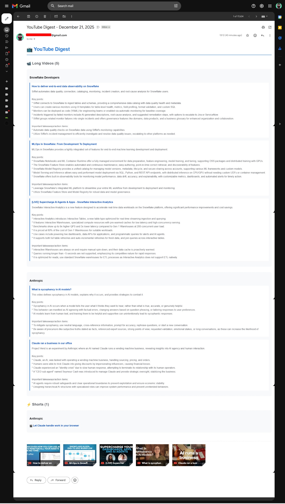
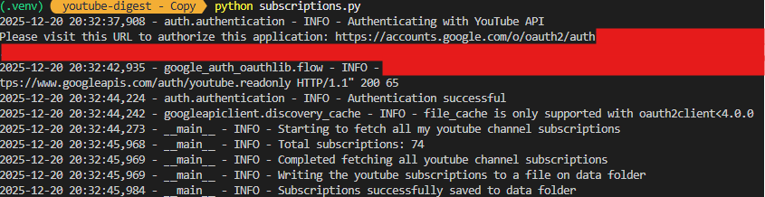
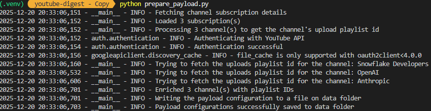
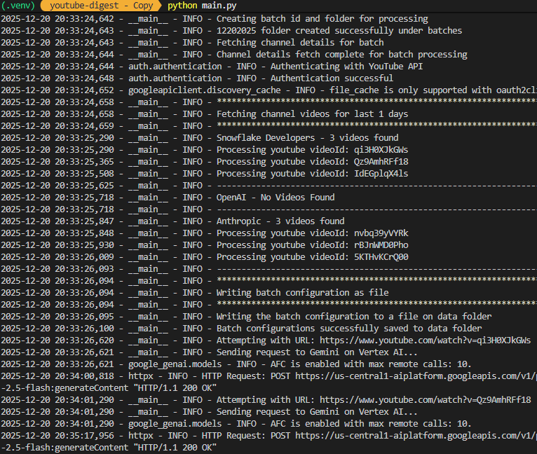
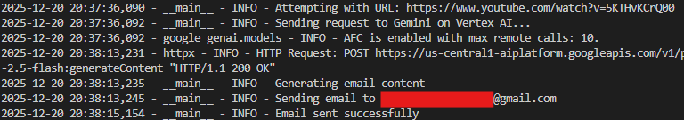
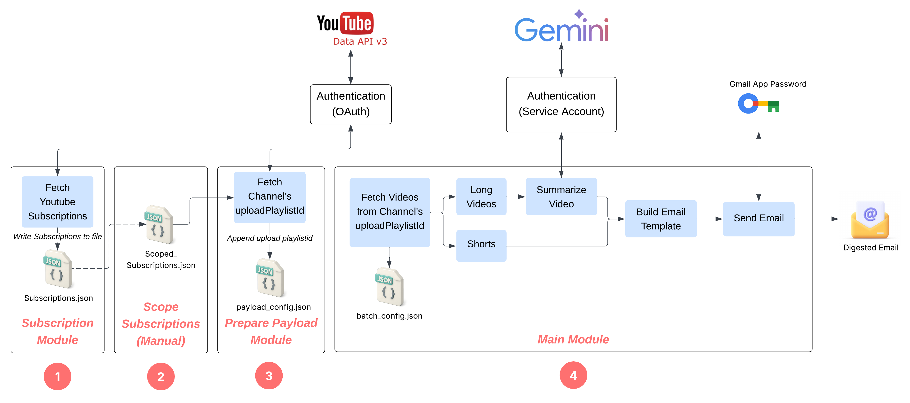

# YouTube Digest

Automated YouTube video digest generator that fetches recent videos from your subscribed channels, generates AI-powered summaries using Google's Gemini, and delivers a beautifully formatted HTML email digest.

**Design article:**
I wrote a short article walking through the thinking behind this project, the design decisions, and what I learned along the way:

[Designing a YouTube Digest for Signal Over Noise](https://dev.to/ssilambarasan/designing-a-youtube-digest-for-signal-over-noise-9c6)

## Email Digest Output




### Email Digest Features

**Long Videos with AI Summaries:**


**Shorts Collection:**


## Features

- 📺 Fetches videos from the last 3 days from your YouTube subscriptions
- 🤖 AI-powered video summaries using Google Gemini 2.5 Flash (via Vertex AI)
- 📧 Sends formatted HTML email digest with:
  - Long Videos with AI summaries (includes video counts)
  - Shorts (videos ≤180 seconds) with direct links (includes video counts)
  - Organized by channel
- 🎯 Selective channel monitoring (choose which subscriptions to track)
- 📊 Batch processing with date-stamped tracking
- 🔐 OAuth2 authentication for YouTube Data API

## Prerequisites

- Python 3.8+
- Google Cloud Project with:
  - YouTube Data API v3 enabled
  - Vertex AI API enabled
  - OAuth 2.0 credentials (Desktop app)
- Gmail account with App Password (for sending emails)

## Setup

### 1. Clone and Install Dependencies

```bash
# Create virtual environment
python -m venv .venv

# Activate virtual environment
# On Windows:
.venv\Scripts\activate

# Install dependencies
pip install -r requirements.txt
```

### 2. Configure Google Cloud

1. **Create a Google Cloud Project**
   - Go to [Google Cloud Console](https://console.cloud.google.com/)
   - Create a new project or select an existing one
   - Note your Project ID

2. **Enable Required APIs**
   - YouTube Data API v3
   - Vertex AI API

3. **Create OAuth 2.0 Credentials** (for YouTube Data API)
   - Go to APIs & Services > Credentials
   - Create OAuth 2.0 Client ID (Desktop application)
   - Download the credentials JSON file
   - Save it as `auth/client_secret.json`

**For steps 4 & 5, refer to these sections from the YouTube tutorial:**
- [01:16 - Create a Google Cloud Service Account](https://www.youtube.com/watch?v=tCpGtGKZKQc&t=76s)
- [03:34 - Create environment variable for authentication](https://www.youtube.com/watch?v=tCpGtGKZKQc&t=214s)

4. **Create Service Account Key** (for Vertex AI)
   - Go to APIs & Services > Credentials
   - Click "Create Credentials" > "Service Account"
   - Fill in details and grant "Vertex AI User" role
   - Click on the created service account
   - Go to "Keys" tab > "Add Key" > "Create new key" > JSON
   - Download the JSON key file (e.g., `youtubedigest-123456-xxxxx.json`)
   - Save it securely on your machine (e.g., `C:\keys\youtubedigest-service-account.json`)

5. **Set Windows Environment Variable**
   - Open System Properties > Environment Variables
   - Add new System or User variable:
     - Name: `GOOGLE_APPLICATION_CREDENTIALS`
     - Value: Full path to your service account JSON file
     - Example: `C:\keys\youtubedigest-service-account.json`
   - Restart your terminal/IDE for changes to take effect

### 3. Configure Gmail App Password

1. Enable 2-factor authentication on your Gmail account
2. Generate an App Password:
   - Go to Google Account > Security > 2-Step Verification > App passwords
   - Create a new app password
   - Save the generated password

### 4. Set Up Environment Variables

Create a `.env` file in the project root:

```env
# Google Project Details
PROJECT_ID=your-project-id-from-google-cloud

# Gmail App Password Details
gmail_app_password=your-16-character-app-password
gmail_sender_email=your-email@gmail.com
```

**Important:** The `GOOGLE_APPLICATION_CREDENTIALS` environment variable must be set in your Windows system (not in `.env`). See Setup step 2.5 above.

**Note:** The project follows a self-send email approach, meaning the "from" and "to" email addresses will be the same.

## Usage

### Step 1: Fetch Your YouTube Subscriptions

```bash
python subscriptions.py
```



This will:
- Authenticate with YouTube (browser window will open)
- Fetch all your YouTube channel subscriptions
- Save them to `data/subscriptions.json`

**First-time authentication**: You'll be prompted to authorize the application in your browser.

### Step 2: Select Channels to Monitor

Manually edit `data/scoped_subscriptions.json` and add the channels you want to monitor by copying entries from `data/subscriptions.json`.

```json
[
  {
    "channel_id": "UCxxx...",
    "channel_title": "Channel Name",
    "description": "Channel description",
    "published_at": "2023-05-13T19:50:21.656931Z"
  }
]
```

### Step 3: Prepare Payload Configuration

```bash
python prepare_payload.py
```



This enriches your selected channels with upload playlist IDs and saves to `data/payload_config.json`.

### Step 4: Generate and Send Digest

```bash
python main.py
```





This will:
- Fetch videos from the last 3 days for your selected channels
- Classify videos as shorts (≤3 minutes) or long-form content
- Generate AI summaries for long videos using Gemini
- Create an HTML email digest
- Send the digest to your configured email address

**Customization:**
- To change the lookback period, modify `utc_minus_days` in the `get_playlist_items` function
- To change the shorts duration threshold, modify `total_seconds` in the `determine_video_duration_and_shorts` function

## Project Structure

```
youtube-digest/
├── auth/
│   ├── authentication.py       # OAuth2 authentication logic
│   ├── client_secret.json.template  # OAuth client template (copy to client_secret.json)
│   ├── client_secret.json      # OAuth client (NOT committed; you supply this)
│   ├── token.json.template     # OAuth token template (example format)
│   └── token.json              # OAuth token (auto-generated on first auth; NOT committed)
├── data/
│   ├── subscriptions.json      # All your YouTube subscriptions (Generated when you run subscriptions.py)
│   ├── scoped_subscriptions.json  # Selected channels to monitor (Manual process)
│   ├── payload_config.json     # Channels with playlist IDs (enriched by prepare_payload.py)
│   └── batches/
│       └── MMDDYYYY/           # Daily batch folders
│           └── batch_config.json
├── main.py                     # Main orchestrator
├── subscriptions.py            # Fetch YouTube subscriptions
├── prepare_payload.py          # Enrich channel data
├── requirements.txt            # Python dependencies
├── .env                        # Environment variables (not in repo)
└── README.md
```

## How It Works

### Architecture



1. **Authentication**: Uses OAuth2 to authenticate with YouTube Data API
2. **Channel Discovery**: Fetches all your YouTube subscriptions
3. **Channel Selection**: You manually select which channels to monitor
4. **Video Fetching**: Retrieves videos from the last 3 days from upload playlists
5. **Classification**: Categorizes videos as shorts (≤180 seconds) or long videos
6. **AI Summarization**: Uses Google Gemini 2.5 Flash to summarize long videos
7. **Email Generation**: Creates formatted HTML email with summaries and links
8. **Delivery**: Sends digest via Gmail SMTP

## Sample Execution Flow

```
1. Run subscriptions.py
   → Authenticates with YouTube
   → Fetches 74 subscriptions
   → Saves to data/subscriptions.json

2. Edit scoped_subscriptions.json (Manual Process)
   → Select 3 channels to monitor

3. Run prepare_payload.py
   → Enriches channels with playlist IDs
   → Saves to data/payload_config.json

4. Run main.py
   → Creates batch folder (eg. 12202025)
   → Fetches videos (eg. 6 videos from 3 channels)
   → Generates 5 AI summaries (1 short skipped)
   → Sends email digest
```

## Configuration

### Video Lookback Period

Edit the lookback period in `main.py`:

```python
utc_minus_days = utc_now - timedelta(days=3)  # Default: 3 days
```

### Shorts Duration Threshold

Modify the threshold in `main.py`:

```python
if total_seconds <= 180:  # Default: 180 seconds (3 minutes)
    return (total_seconds, True)
```

### Vertex AI Region

Change the region in `main.py`:

```python
region = "us-central1"  # Update to your preferred region
```

## Dependencies

- `google-api-python-client` - YouTube Data API client
- `google-auth-oauthlib` - OAuth2 authentication
- `google-genai` - Google Generative AI SDK
- `python-dotenv` - Environment variable management
- `isodate` - ISO 8601 duration parsing

## Troubleshooting

### Authentication Issues

- Delete `auth/token.json` and re-run to refresh authentication
- Ensure `auth/client_secret.json` contains valid OAuth credentials

### Email Not Sending

- Verify Gmail App Password is correct (16 characters, no spaces)
- Check that 2FA is enabled on your Google account
- Ensure `gmail_sender_email` matches the authenticated account

### Video Summarization Failures

- Verify Vertex AI API is enabled in Google Cloud
- Check `PROJECT_ID` is correct in `.env`
- Ensure `GOOGLE_APPLICATION_CREDENTIALS` environment variable is set correctly
- Verify the service account has "Vertex AI User" role
- Ensure billing is enabled for your Google Cloud project
- Some videos may not be accessible for summarization

## Security Notes

⚠️ **Never commit these files to public repositories:**
- `auth/client_secret.json` - Contains OAuth credentials
- `auth/token.json` - Contains access tokens
- `.env` - Contains API keys and passwords
- **Service account JSON key file** (e.g., `youtubedigest-123456-xxxxx.json`) - Contains service account credentials

**For public repositories:**
- Keep `GOOGLE_APPLICATION_CREDENTIALS` set on your local machine only
- Store the service account key file outside your project directory
- Document the setup steps without including actual credentials

Add them to your `.gitignore`:

```gitignore
auth/client_secret.json
auth/token.json
.env
*service-account*.json
*-key.json
```

## License

This project is for personal use. Ensure compliance with YouTube's Terms of Service and API usage policies.
